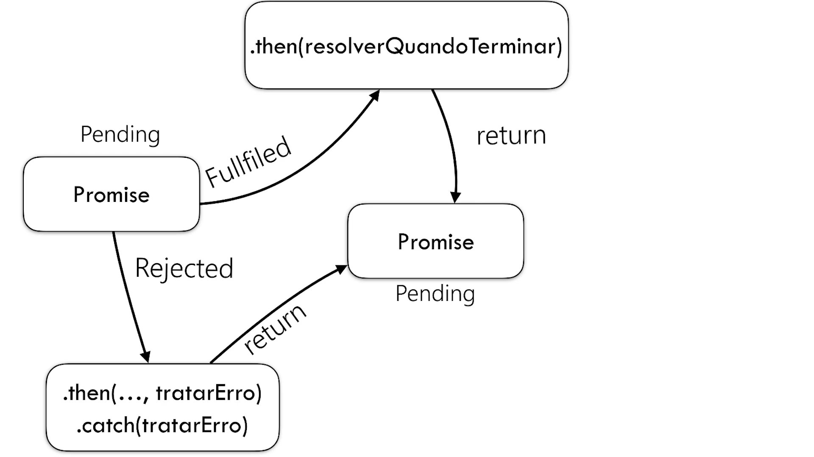

# CICLO DE VIDA DE PROMISES

### PENDING: 

- Estado inicial, ainda não terminou ou ainda não foi rejeitada.

### FULFILLED:
    
- Quando operou todas as operações com sucesso.

### REJECTED:

- Quando a operação falhou.

 
 
